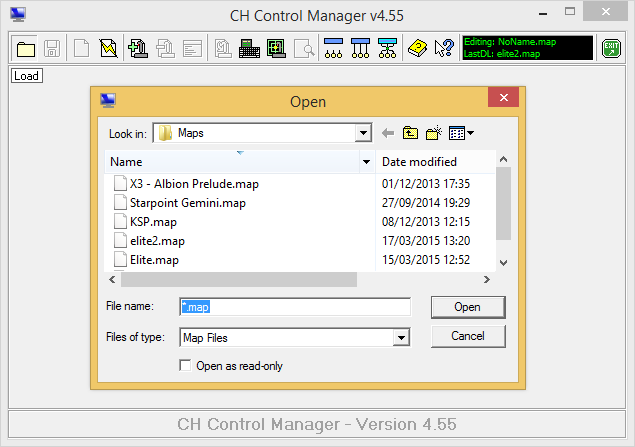
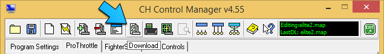

# CH Products Joystick Map for Elite: Dangerous

Joystick maps and game configuration files for the [CH Products][] [Fighterstick][], [Pro Throttle][] and [Pro Pedals][] HOTAS in [Elite: Dangerous][].

## About

Forked and then butchered shamelessly.

## Requirements

* [CH Products][] [Fighterstick][]
* [CH Products][] [Pro Throttle][]
* [CH Products][] [Pro Pedals][]
* [CH Products][] [Control Manager][] software
* [Elite: Dangerous][] 1.2.03 or above
* Optional: PDF viewer

## Installation

Download and extract.

### Joystick Maps

Navigate to `My Documents` and create a folder called `CH Control Manager` if it doesn't already exist, and under it a folder called `Maps`.

Within the extracted zip file under the `maps` folder you'll find four files. These need to be copied to the `CH Control Manager/Maps` folder.

Plugin your [Fighterstick][], [Pro Throttle][] and [Pro Pedals][], then launch the [CH Control Manager][Control Manager]. Load `elite.map`. The load dialog should default to the folder you copied your maps to. If it doesn't just navigate to that folder. 

Once loaded click the `Download` button to enable the map.

### Game Configuration

Within the extracted zip file under the `config` folder you'll find two files called `Custom.binds` and `StartPreset.start`. Copy `Custom.binds` to
`%LOCALAPPDATA%\Frontier Developments\Elite Dangerous\Options\Bindings\Custom.binds`. `%LOCALAPPDATA%` points to the hidden `AppData\Local` folder for _your_ Windows account. The `Custom.binds` file works for both the _full_ and _redux_ maps.

You can optionally copy `StartPreset.start` to the same folder. All this does is tell the game to use the custom bindings by default. If you don't copy the file you'll need select the custom layout from within the game under the input settings.

## Cheat Sheet

Within the extracted zip file, under the `layouts` directory, you'll find the PDF cheat sheet for the map.

## Caveat Emptor

With the exception of the PDF all the files contained in this project are text files so, in theory, nothing bad can happen to your system. That said, you're messing about with game config files so if you break anything, you get to keep both halves. If in doubt always back up.

[CH Products]: http://www.chproducts.com/
[Fighterstick]: http://www.chproducts.com/Fighterstick-v13-d-722.html
[Pro Throttle]: http://www.chproducts.com/Pro-Throttle-v13-d-719.html
[Pro Pedals]: http://www.chproducts.com/Pro-Pedals-v13-d-716.html
[Elite: Dangerous]: http://www.elitedangerous.com/
[Control Manager]: http://www.ch-hangar.com/forum/index.php/files/file/49-control-manager/
